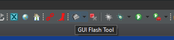
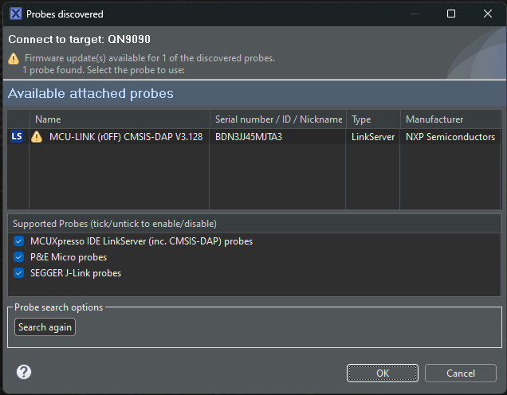
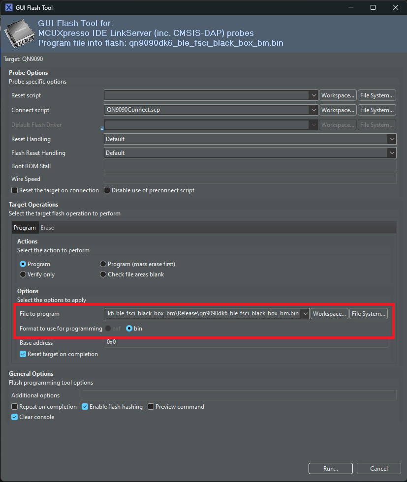

# Updating the murata firmware
Before use with the actuator, the murata firmware needs to be updated. 
The firmware file can be found in the aliro-th-additions folder. 
(run `git submodule init` and `git submodule update` if this folder is missing.)
The firmware file is named `uwb_ble_device_fw-v05.00.00.bin` (or a later version). 
The murata can be updated with the DK6Programmer tool, or with MCUxpresso and a debugger.

## Using DK6Programmer (windows only)
The murata firmware can be updated using the DK6programmer.
This programmer can be found in the QN9090 SDK (https://mcuxpresso.nxp.com/download/bf1290eddeaab7cfc21a223827bc6229).
Unzip the SDK folder and go to tools\JN-SW-4407-DK6-Flash-Programmer. 
run the "JN-SW-4407 DK6 Production Flash Programmer v4564.exe" to install the programmer.

you can now update the murata with the following command:
```
DK6Programmer.exe -V 0 -P 1000000 -s <comport> -Y -p <binary>
```
where <comport> is replaced with the comport (for example COM22) and <binary> with the binary name.

## Using MCUxpresso and a debugger.

You can use a MCU link (https://www.nxp.com/design/design-center/software/development-software/mcuxpresso-software-and-tools-/mcu-link-debug-probe:MCU-LINK) for this, but most debuggers should work. Mcuxpresso can be found here: https://nxp.flexnetoperations.com/control/frse/product?entitlementId=654776707&lineNum=1. 

To flash the murata board, connect the debugger to the TP31 connector. Then, in mcuxpresso, use the GUI flash tool:  

 
Press ok when the debugger is found:  


Set the format to bin and select the correct binary, then press run to flash the device:


# Connecting the murata board
The murata board can be connected with a USB micro cable.
The tool expects the connection to the murata board to be on ```/dev/ttyUSB0```, 
which is the case by default. When this not the case (when for example another device 
is already using this name), you can change the location in 
```src/aliro_actuator/transport_protocol/ble_uwb.py```, by changing the 
```DEFAULT_PORT``` variable.


# UWB firmware
Inside the aliro-th-additions folder there is also the firmware that is loaded for the SR150 from the Murata board controller.  
This firmware enables the UWB chip to be used for CCC ranging sessions along with the ucitool.
This firmware does not need to be loaded by the user manually, the upload is done automatically by the ucitool.

Firmware for uwb: `aliro_IOT.SR150_MAINLINE_PROD_FW_46.42.01_c366707f17a03.bin`
